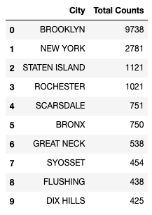
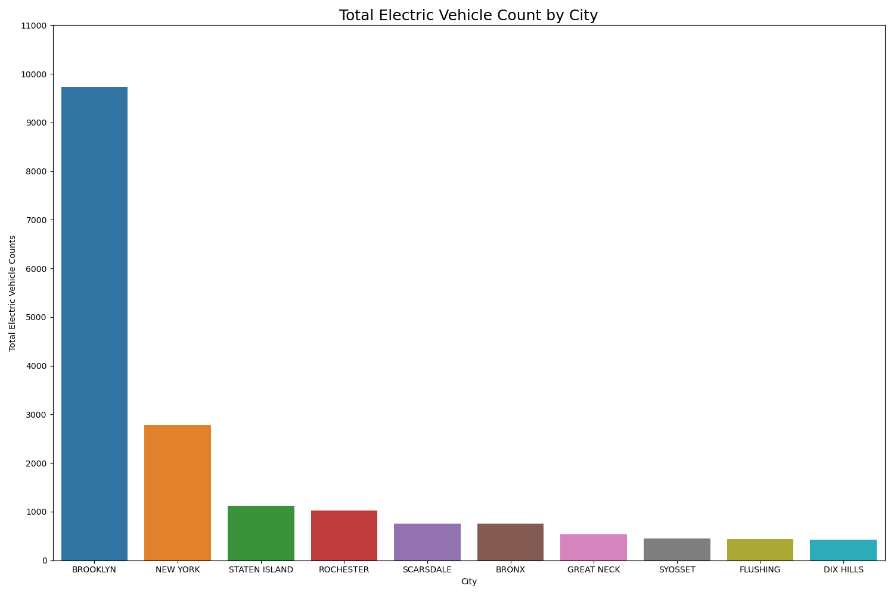
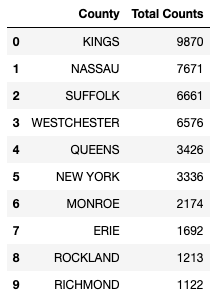
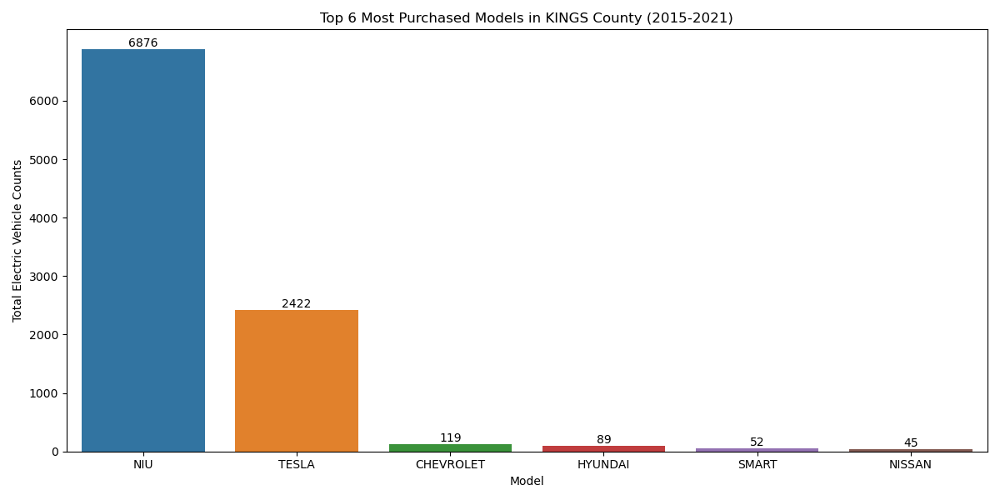
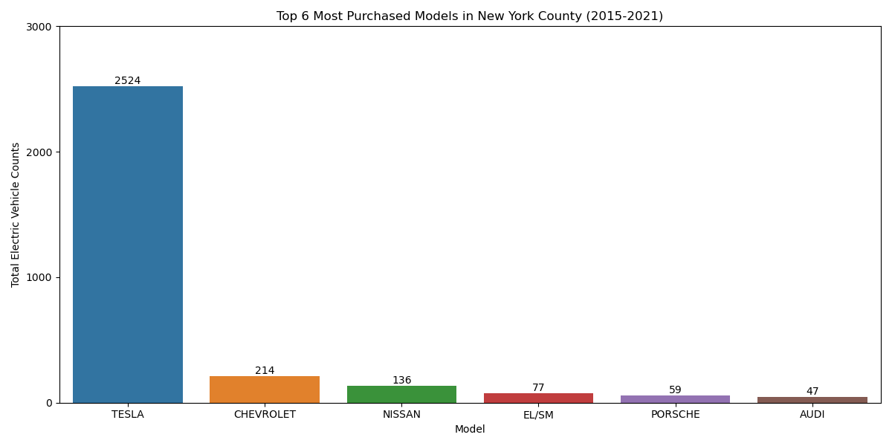
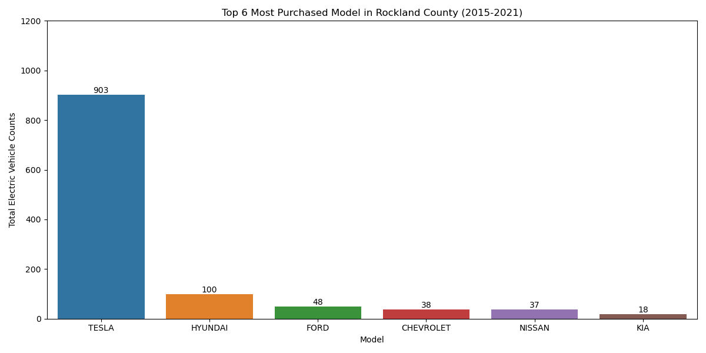

# Electric Vehicle Projected Sale Analylsis

## Overview of Analysis

As the leader of the free world, the United States through its Federal Government has set a goal to make half of all new vehicles sold in the U.S. in 2030 zero-emissions vehicles, and to build a convenient and equitable network of chargers to help make EVs accessible to all Americans for both local and long-distance trips.
On a recent poll conducted by The U.S department of transportation, in rural parts of the country—home to 20 percent of Americans and almost 70 percent of America’s road miles—EVs can be an especially attractive alternative to conventional vehicles. Rural residents tent to drive more than their urban counterparts, spend more on vehicle fuel and maintenance, and often have fewer alternatives to driving to meet their transportation needs. Over the long run, the plan for the federal government with climate change in mind, is to showcase how EVs will help residents of rural areas reduce those costs and minimize the environmental impact of transportation in their communities. 
A team of Data Analysts having in common their implication in Climate change and EVs decided then to run an analysis on the forecast of demand in EV vehicles and charging stations for the coming years. They decide to use New York State datasets available for EV registrations and current charging stations with an idea in mind if they can do it in "Empire State" , they could do a similar analysis accross the country.

## Data

- Data Source : https://data.ny.gov. https://data.world/
- Article Source : https://www.transportation.gov/rural/ev

## Communication Protocol

There are three members in our team. The role of each team member will remain the same each week to ensure that we had an expert for each topic of the project. A Slack channel was created to support communication amongst the team, and will be used to assign tickets, provide updates, and discuss any issues. The team will additionally have meetings twice a week to go over project progress and next steps.

## Data Exploration and Preliminary Analysis

### Amount of Electric Vehicles on the Road in New York State ( 2012 - 2021 ) 

### Electric Vehicles on the Road by City ( 2012 - 2021 ) 

Top 10 cities:

### Electric Vehicles on the Road by County ( 2012 - 2021 ) 

Number of electric vehicle over time for 10 counties based on the total number of electric vehicle in 2021:

### Most Purchased Car Models by County 

Top 10 countie:

Top 6 electric vehicle models in Kings county:

Top 6 electric vehicle models in Nassau county:

Top 6 electric vehicle models in Suffolk county:

Top 6 electric vehicle models in Westchester county:

Top 6 electric vehicle models in Queens county:

Top 6 electric vehicle models in New York county:

Top 6 electric vehicle models in Monroe kcounty:

Top 6 electric vehicle models in Erie county:

Top 6 electric vehicle models in Rockland county:

Top 6 electric vehicle models in Richmond county:

## Machine Learning Models

## Result of Analysis

## Recommendations for Future Analysis