# Electric Vehicle Projected Sales

## Overview of Analysis

*“ The global electric vehicle market was valued at $163.01 billion in 2020, and is projected to reach $823.75 billion by 2030, with a compound annual growth rate (CAGR) of 18.2% from 2020 to 2030. ”*

Electric vehicles (EVs) are vehicles that are either partially or fully powered on electric power. The electric vehicle was primarily designed to replace conventional ways of travel as they lead to environmental pollution. It has gained popularity, owing to numerous technological advancements. It outperforms conventional vehicles providing higher fuel economy, low carbon emission & maintenance, smoother drive, and reduced sound from engine. 

As the leader of the free world, the United States through its Federal Government has set a goal to make half of all new vehicles sold in the U.S. in 2030 zero-emissions vehicles, and to build a convenient and equitable network of chargers to help make EVs accessible to all Americans for both local and long-distance trips. On a recent poll conducted by The U.S department of transportation, in rural parts of the country—home to 20 percent of Americans and almost 70 percent of America’s road miles—EVs can be an especially attractive alternative to conventional vehicles. Rural residents tent to drive more than their urban counterparts, spend more on vehicle fuel and maintenance, and often have fewer alternatives to driving to meet their transportation needs. Over the long run, the plan for the federal government with climate change in mind, is to showcase how EVs will help residents of rural areas reduce those costs and minimize the environmental impact of transportation in their communities. A team of Data Analysts having in common their implication in Climate change and EVs decided then to run an analysis on the forecast of demand in EV vehicles and charging stations for the coming years. They decide to use New York State datasets available for EV registrations and current charging stations with an idea in mind if they can do it in "Empire State" , they could do a similar analysis across the country.

This analysis focused on the time series modeling of the amount of EVs in New York State (NYS). After exploring the data of EV registrations and the number of charging stations in NYS from 2012 to 2021, a machine learning model was built to predict the EV sales in NYS in 2023 and 2024, as well as the demand for EV charging stations.

## Database

- The database for this project was setup using AWS's relational database service (RDS),
- The structure of the database and the relations between database objects were designed using the QuickDBD tool. The ERD diagram is shown below.

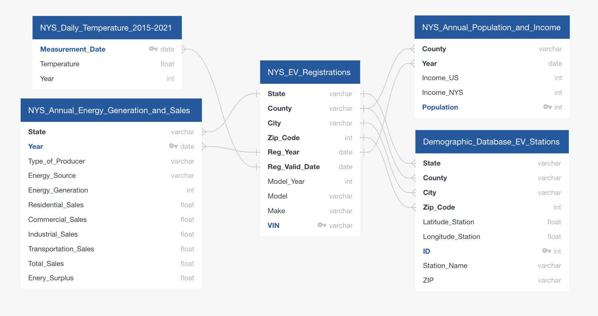

### Data Sources

- https://data.ny.gov
- https://data.world
- https://www.eia.gov/totalenergy/data/monthly/

## Communication Protocol

There are three members in our team. The role of each team member is indicated by a particular shape: square, circle, triangle. The team member in the square role is responsible for the Github repository including data exploration and visualization. The member in the circle role is in charge of data collection and data cleaning. The member in the triangle role is responsible for creating a machine learning model. The role of each team member will remain the same most of the time to ensure that we have an expert for each topic of the project. 

A Slack channel was created to support communication amongst the team members, and was used to assign tickets, provide updates, and discuss any issues. The team would additionally have meetings twice a week to go over project progress and next steps.

## Data Exploration and Preliminary Analysis

### *Number of EVs on the Road in NYS Over Time (2015-2021)*

The total number of EVs registered in NYS per year is:

> As we can see above, the electric vehicle registration in NYS have been increasing exponentially over the past years. The total number of EVs in **2021** was 40356, which was over 791 times larger than the total number of EVs in **2015** (51).

### *Total Number of EVs on the Road by City*

Top 10 cities with the largest total number of EVs in NYS from 2015 to 2021:

> As we can see, **Brooklyn** (10075), **New York** (3017), and **Staten Island** (1207) were the top 3 cities with the largest total number of EVs in NYS from 2015 to 2021.

### *Number of EVs on the Road by County Over Time (2015-2021)*

For statewide trend, we explored the EV registrations from 2015 to 2021 in 10 top counties:

> From the line chart above, we noticed that **Kings County** was growing much faster compared to other counties. This result is expected because Kings County is the most populous county in NYS, and the second-most densely populated county in the U.S.. It is also coextensive with Brooklyn city, which has the largest total number of EVs in NYS (2015-2021).

### *Popularity of Car Models by County*

One of the most important parts in the EV sales analysis is the popularity of electric vehicle models. In order to study the market of EV models in NYS, frist we selected the top 10 counties with the largest total number of EVs from 2015 to 2021. Next, We figured out the top 6 most purchased models in each of these counties.

The top 10 counties selescted:

Bar graphs were used to show the difference between top 6 most purchased EV models:

**- Kings County**

**- Nassau County**

**- Suffolk County**

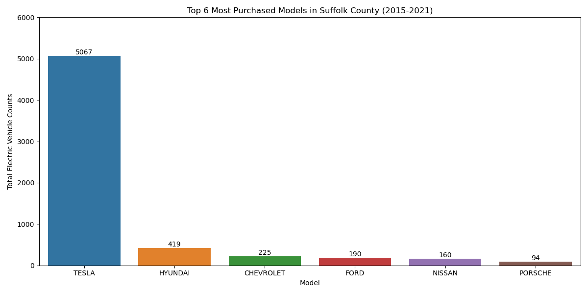

**- Westchester County**

**- Queens County**

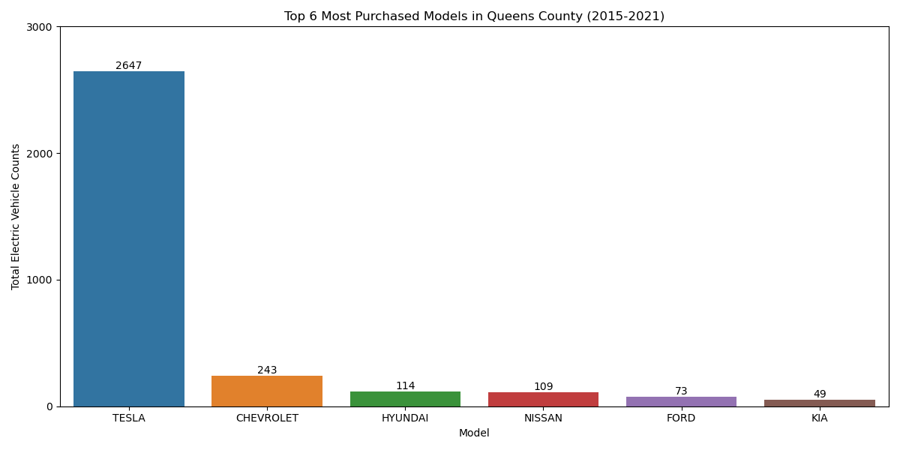

**- New York County**

**- Monroe County**

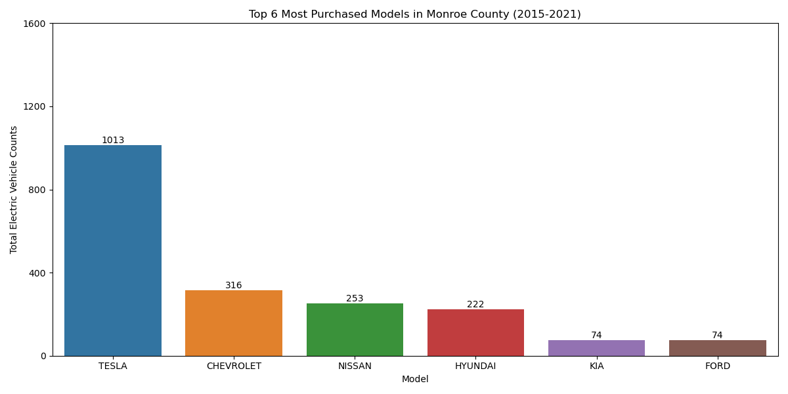

**- Erie county**

**- Rockland county**

**- Richmond county**

> **Tesla**, **Chevrolet**, and **Hyundai** were the most purchased EVs in each of these counties from 2015 to 2021. Moreover, Tesla was the top 1 purchased EV modles in each of these counties. It is a relatively lower priced luxury electric vehicle that was designed to appeal to the mass market. In 2021, Tesla had the most worldwide sales of EVs, capturing 21% of the battery-electric (purely electric) market and 14% of the plug-in market (which includes plug-in hybrids). 

## Machine Learning Models for the Number of EVs on the Road by County in Future

### Finding the Best Fit Model

In this project, we aimed to predict the demand for EVs in each county in NYS and find the top 3 counties to invest for setting EV charging stations based on the demand. To do so, first, we would build and train a time series machine learning model for the number of EVs in NYS. Next, we could use this model to predict the number of EVs in the top 6 counties with the most purchased EVs from 2015 to 2021 in NYS.

To find the best-fit model, let's use the number of EVs in **Kings County** as a sample. 

**- Kings County**

#### *Seasonality Check*

To check for seasonality, we performed the time series decomposition analysis to Kings County. Decomposition can provide a useful abstract model for thinking about time series generally and for better understanding problems during time series analysis and forecasting.

We decomposed the number of EVs in Kings County from 2015 to 2021 into trend, seasonal and noise components. As a result, the number of EVs in King County had an upward trend and a seasonality pattern.

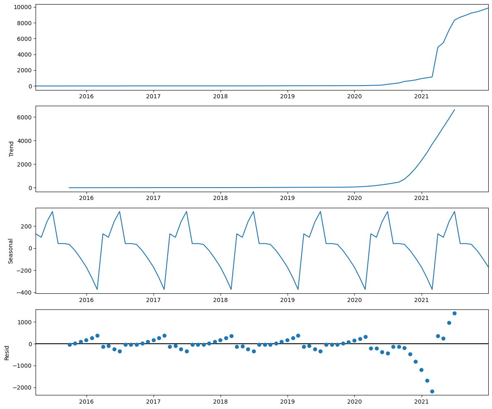

#### *Split Train and Test sets*

In order to validate the performance of this model, we splitted the data into two sets: a training set and a testing set. After multiple iterations, we found that the best performance was achieved with a split ratio of 0.85/0.15, 85% of the data in the training set and 15% in the testing set.

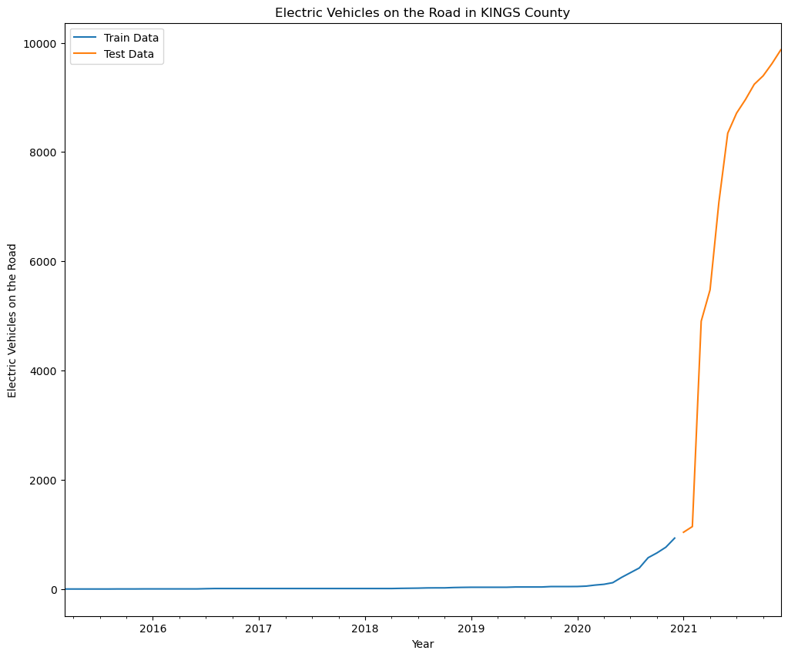

#### *Finding the Best Parameters with Auto-Arima*

To get a model which can accurately predict future data in a series, we used auto-ARIMA to optimize the p,d,q values for each county and the validation of the models. The best parameters (based on the AIC score) were (1,1,2) without the seasonal component. Then, we plugged these into a SARIMAX model to have our final model. We could validate it by looking at the forecasts and the test set. Below is the result after plug these into a SARIMAX model:

Let’s have a look at the residual information below.The residuals are almost fairly close to being normally distributed. We can accept this as the best model and move onto making and plotting predictions.

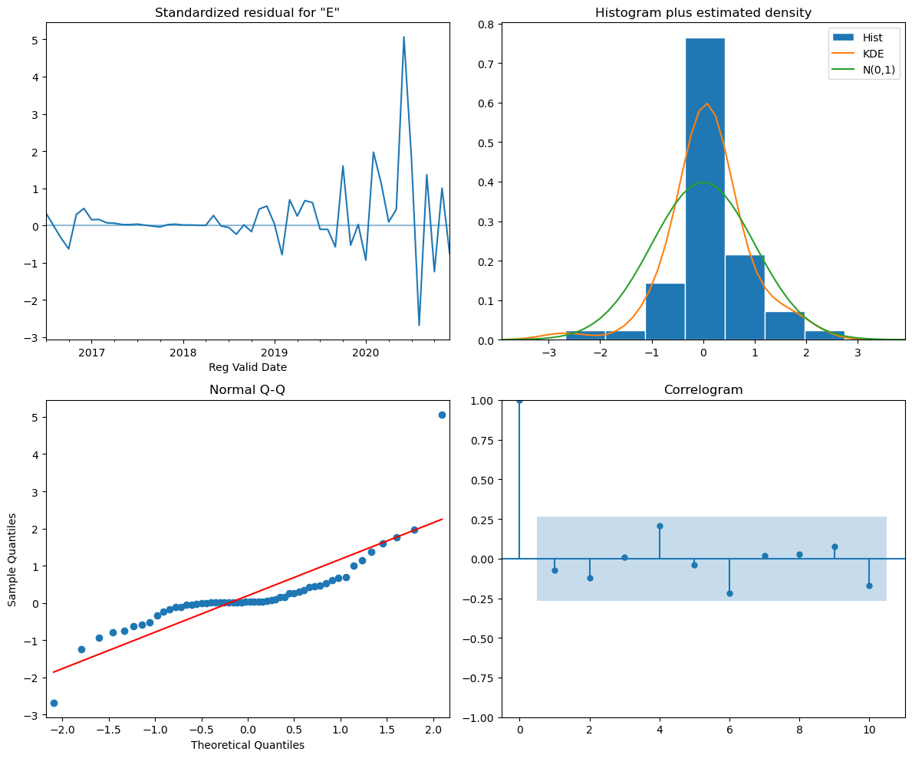

We fitted this model to Kings County to get the forcasted data as the figure below. We can see that the model is not able to accurately forecast data into the future. The actual observed data is not within the confidence interval of our model's forecasts. This is mainly due to the fact that major part of the trained data deal in the linear part of time-series. while, as of 2020, the trend of EV vehicle followed an exponential pattern. We need to reduce the time period to achive more acurate information for the Kings county.

#### *Future Predictions*

Now, we know that our model can accurately make predictions about the future EV counts in each county. Thus, we would use the same parameters to build a model on the whole observed dataset without splitting it into train/test sets.

> The model predictes that the number of EVs in King County are going to keep increasing almost linearly at a slower rate, based on the mean values. However, in the the upper confidence interval, the increaseing follows an exponential pattern.

Next, we would fit this model to **Nassau County**, **Suffolk County**, **Westchester**, **Queens County**, and **New York County** in order to predict the number of EVs in 2023 and 2024.

### Future Predictions for Other Counties

**- Nassau County**

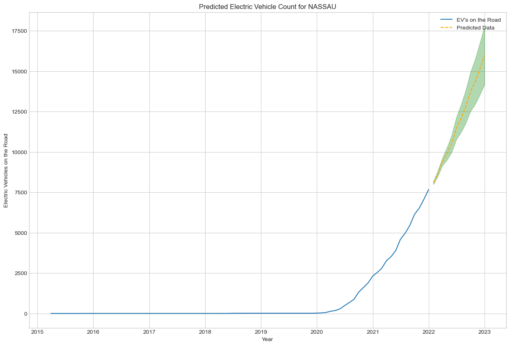

> The model is predicting that the number of EVs in Nassau County will keep increasing exponentially in the coming years.

**- Suffolk County**

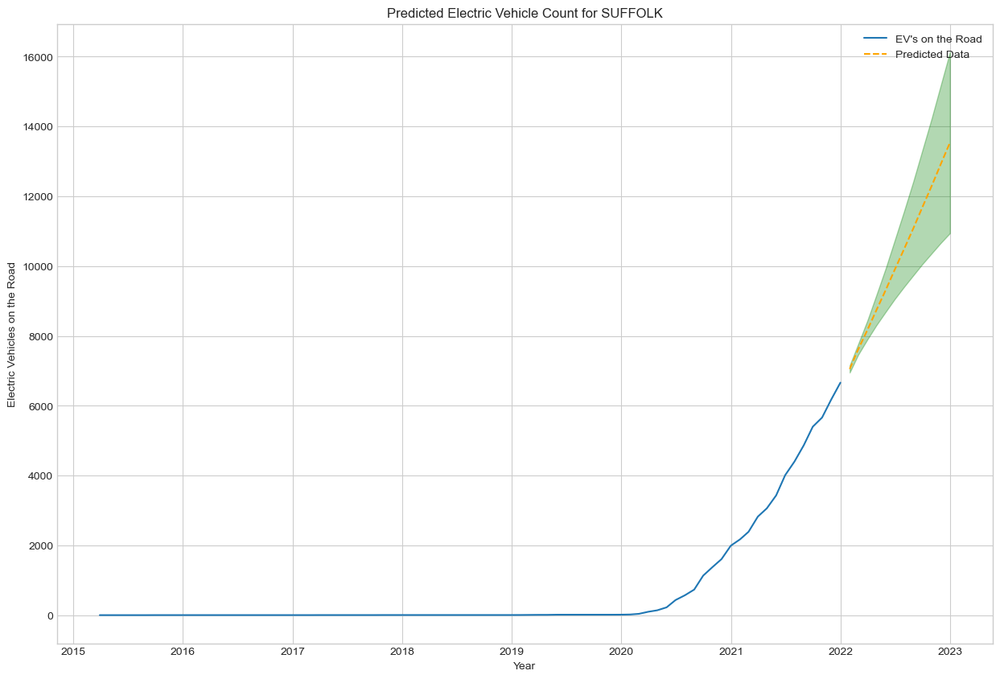

> The model is predicting that the number of EVs in Clark County will keep increasing exponentially in the coming years (the upper confidence limit).

**- Westchester County**

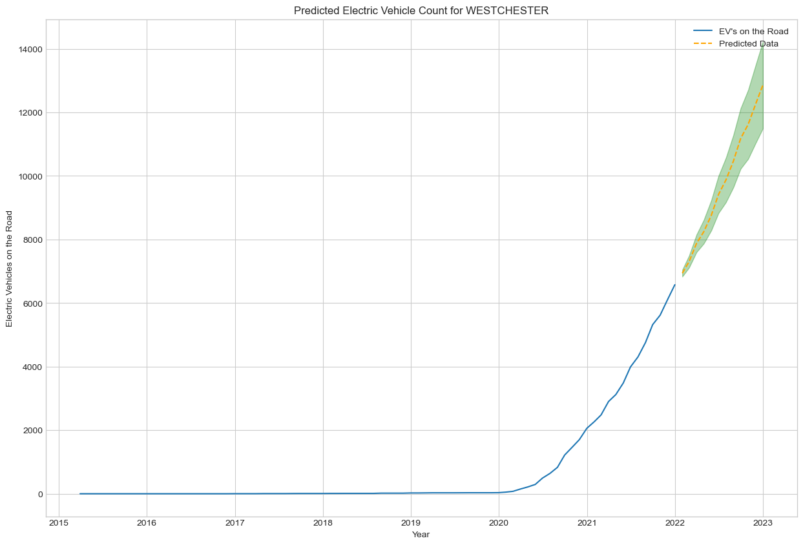

> The model is predicting that the number of EVs in Westchester County are going to keep increasing at a linear rate (based on the mean prediction). However, if we look at the upper and lower confidence intervals we also see the possibilities of an exponential increase and a leveling off.

**- Queens County**

> The model is predicting the number of EVs in QUEENS County to keep increasing exponentially. 

**- New York County**

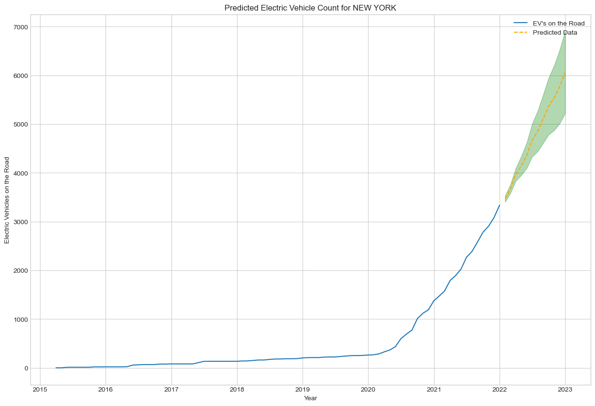

> The model is predicting the number of EVs in New York County to keep increasing exponentially.

## Number of Charging Station in NYS

### Current Number of Charging Stations by County (Top 10)

Predicting the demand for EVs in each county in NYS is one of the purpose for this project. The other purpose is to find the top 3 counties to invest for EV charging stations based on this demand. The table below is the current total number of charging stations per county in NYS.

> **New York County** has the largest number of charging stations (357) in NYS, followed by **Albany County** (331), and **Erie county** (212). The number of charging stations in **Kings County** is only 108, which might be not enough comparing with the EV registrations in Kings county.

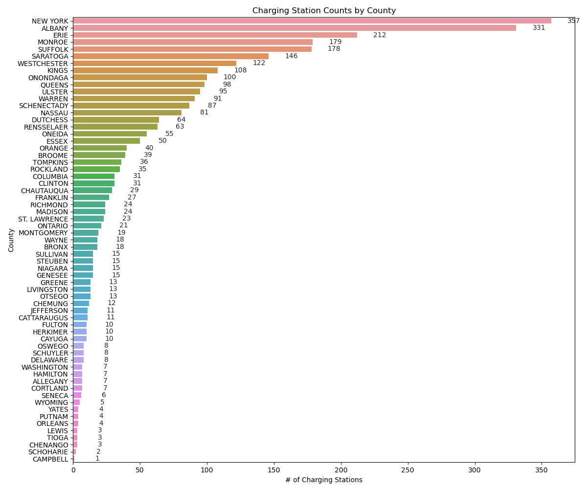

> You can find the charging station counts for all the counties in NYS in the bar chart above.

### Number of Charging Stations vs. Number of EVs on the Road

The table below compares the numbers between existing charging stations and EVs 2021:

> From the table above, **Kings County** has the largest predicted number of EVs in 2023, with around 38135 new EVs added on the road. At that time, there will be 448 EVs per charging station in Kings County, which makes it the best county to invest for EV charging stations. Another county good to invest for EV charging stations will be **Nassau County**. There is only 81 charging stations in Nassau County currenetly. From the prediction, there will be 10216 EVs added by the end of 2023, with about 231 EVs per charging station. The 3rd county good to invest for EV charging stations is **Westchester County**. The number of EVs per chatging station in Westchester County will be 121 in 2023 by prediction. 

## Conclusions 

- The city with the largest total number of EVs in NYS from 2015 to 2021 is **Brooklyn** (10075).

- Top 10 counties with the largest total number of EVs from 2015 to 2021 are Kings County, Nassau County, Suffolk County, Westchester County, Queens County, New York County, Monroe County, Erie County, Rockland County, and Richmond County. In each of these counties, top 3 most purchased EV models are **Tesla**, **Chevrolet**, and **Hyundai**.

- By 2023, top 6 counties with the largest predicted number of EVs will be Kings County, Nassau County, Westchester County, Suffolk County, Queens County, and New York County.

- Top 10 counties with the largest current number of charging station in NYS: New York County, Albany County, Erie County, Monroe County, Suffolk County, Saratoga County, Westchester County, Kings County, Onondaga County, Queens County.

- Top 3 best counties to invest for charging stations: **Kings County**, **Nassau County**, **Westchester County**.

## Recommendations for Future Analysis

## Sources
- https://www.alliedmarketresearch.com/electric-vehicle-market
- https://www.caa.ca/sustainability/electric-vehicles/engine-options/
- https://www.transportation.gov/rural/ev
- https://en.wikipedia.org/wiki/Tesla,_Inc.
